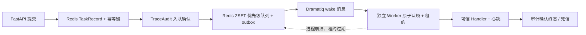

# 有界异步 Task Runtime

Task Runtime 为长任务和高并发安全任务提供两种使用同一公共契约的运行模式：本地/测试默认使用进程内
有界调度器，Compose 默认使用 Redis 8.2.3 + Dramatiq 2.2.0 多进程调度器。两种模式都实施优先级、三池
舱壁、背压、主体级幂等、有限重试、审计确认状态机和死信查询；分布式模式额外提供持久 outbox、Worker
租约、心跳、过期重投和 AOF 恢复。

## 结构

- `safeagent_gov/task_runtime/contracts.py`：任务类型、优先级、状态、身份、池配置与指标契约；
- `dispatcher.py`：本地有界 `asyncio.PriorityQueue` 调度器；
- `redis_store.py`：Redis 任务记录、ZSET 优先级队列、租约、幂等键、outbox、死信和指标事务；
- `distributed.py`：API 侧持久化提交、outbox 投递和周期对账；
- `dramatiq_broker.py`、`dramatiq_workers.py`：固定 Redis Broker 与三类独立 wake Actor；
- `worker_runtime.py`：可信 handler 执行、心跳、超时、有限重试和审计确认终态；
- `handlers.py`：显式绑定 PromptShield、Agent、SkillScan 和 Eval handler，不按请求动态导入代码；
- `defaults.py`：由 `SAFEAGENT_TASK_RUNTIME_MODE` 显式选择 `in_memory` 或 `redis_dramatiq`；
- `backend/api/task_api.py`：Bearer、RBAC、租户隔离、提交、查询、死信、指标与 SSE；
- `research_technology/benchmarks/runners/eval_task_runtime.py`：1000 任务零丢失压力门禁；
- `research_technology/benchmarks/runners/eval_distributed_recovery.py`：真实 Worker `SIGKILL`、租约接管和 Redis AOF 重启门禁。

默认池如下：

| 池 | Worker | 队列容量 | 任务 |
|---|---:|---:|---|
| security | 16 | 1200 | PromptShield、SkillScan |
| agent | 8 | 256 | 完整 Agent 子任务 |
| evaluation | 1 | 32 | 评测任务，避免共享结果文件竞争 |

本地模式在同一进程内为三池创建独立 Worker；Compose 分别启动 `worker-security`、`worker-agent` 和
`worker-evaluation` 容器，某一类任务饱和或崩溃不会占用其他池的执行槽。

## 分布式提交与恢复



- Redis 是任务状态真相源；Dramatiq 消息只负责唤醒对应池，Worker 必须从 ZSET 原子认领最高优先级任务；
- 入队事务同时写优先级队列和 outbox。API 在通知 Broker 前崩溃时，重启后的对账器仍会投递；重复 wake
  不会重复认领同一任务；
- Worker 默认每 5 秒内续租，Compose 租约为 15 秒。进程消失后，对账器把过期 running 任务重新置为
  queued，并递增 `delivery_count`、`recovered_count`；
- Dramatiq 框架重试固定为 0，避免与应用重试叠加；只有超时和 `TaskTransientError` 可在 `max_attempts`
  范围内重试；
- 永久失败进入应用死信集合，并可由受权角色查询；Dramatiq 自身仍保留 7 天 Broker 死消息；
- Redis 使用 AOF `everysec` 和命名卷。该设置已经验证正常重启恢复，但不是跨机高可用；Redis 主机突然
  掉电仍存在约一秒持久化窗口，生产环境需 Sentinel/Cluster 或受管 Redis。

## 状态与失败语义

状态机为 `queued → running → succeeded/failed`，过载任务进入可查询的 `rejected` 终态。

- critical/high 在队列满时只等待一个很短的受控入队窗口；medium/low 立即背压，API 返回 429；
- 只有 `TaskTransientError` 和超时可在 `max_attempts` 内重试，业务/契约/权限错误不重试；
- 入队审计失败时 handler 不启动；完成审计失败时即使 handler 已返回也标记失败，不对外宣称成功；
- 每个成功任务至少记录 `task_queued`、`task_started`、`task_completed` 和 `final_output`；
- 幂等键绑定租户、主体和键值，跨租户/跨用户不会复用任务；
- payload 上限 256 KiB，handler 结果上限 1 MiB，状态存储有界，防止队列成为内存放大器；
- SSE 只流式输出脱敏状态，不返回原始 payload。

分布式交付语义是 **at-least-once**，不声称跨 Redis 与 SQLite 的 exactly-once。安全检查 handler 必须幂等；
真实工具副作用仍由一次性能力票据、参数绑定和重放保护控制。若 Worker 在“审计已写、Redis 终态未提交”
之间崩溃，恢复执行可能产生重复阶段事件，但哈希链仍保持完整，任务不会被错误标成无审计成功。

## API

| 方法 | 路径 | 作用 |
|---|---|---|
| POST | `/api/tasks/submit` | 提交类型化异步任务，返回 202 与 task/trace |
| GET | `/api/tasks` | 查询当前租户最近任务 |
| GET | `/api/tasks/{task_id}` | 查询租户内任务状态与结果 |
| GET | `/api/tasks/{task_id}/events` | 通过 SSE 观察状态变化 |
| GET | `/api/tasks/metrics` | 查询队列深度、活跃数、拒绝、重试、审计与池指标 |
| GET | `/api/tasks/dead-letter` | 管理员/安全复核员/审计员查询死信；非管理员限制当前租户 |

客户端 payload 不能提供 tenant、actor、role 或执行 handler。Eval 与 SkillScan 另有角色门禁，Agent 场景继续
使用四场景目录的角色授权。

## 1000 任务门禁

```bash
./scripts/uv_run.sh python research_technology/benchmarks/runners/eval_task_runtime.py
```

当前固定环境结果：1000 接收、1000 终态成功、丢失 0、拒绝 0、4000/4000 调度审计事件、强制覆盖 1.0、
最大并发 32，约 634 tasks/s，P95 约 1.53s。压力 handler 是注入的无副作用安全检查桩，用于隔离验证队列、
Worker、状态和审计机制；它不代表 1000 个完整 LLM Agent 的吞吐。分布式恢复另由下述真实容器门禁验证。

## Worker 强杀与 AOF 门禁

先启动默认 Compose，再执行：

```bash
./scripts/uv_run.sh python research_technology/benchmarks/runners/eval_distributed_recovery.py
```

该脚本只对 `worker-security` 注入测试延迟，等待任务被原子认领后发送 `SIGKILL`，随后以无故障配置启动替代
Worker；任务租约过期后必须成功接管。最后等待 AOF fsync、重启 Redis，并通过鉴权 API 查询同一终态。
当前实测为 2 次投递、1 次恢复、15.702 秒恢复、运行时恢复增量 1、审计链有效、Redis 重启后终态仍在、
危险执行 0。结果见
`research_technology/benchmarks/results/distributed_recovery_v1.json`。故障开关默认是 0，脚本的 `finally` 会恢复正常 Worker。

## 验证

```bash
./scripts/uv_run.sh python -m pytest -q tests/test_task_runtime.py
./scripts/uv_run.sh python -m pytest -q tests/test_distributed_task_runtime.py
./scripts/uv_run.sh python -m mypy safeagent_gov/task_runtime backend/api/task_api.py
./scripts/uv_run.sh python -m ruff check --no-cache safeagent_gov/task_runtime backend/api/task_api.py
docker compose -f research_technology/reproducibility/docker/docker-compose.yml config --quiet
```
