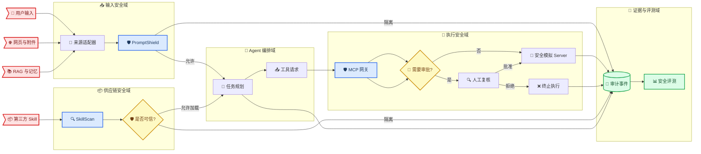

# 智御政安威胁模型

_面向政企智能体输入、执行、供应链与审计链路的阶段 1 安全边界，版本 0.1.0。_

---

## 🎯 范围与安全目标

威胁模型覆盖用户、网页、附件、RAG、记忆、Agent、MCP、Skill 和审计存储。当前系统的首要目标是：不可信内容不能越过指令边界，未授权工具与数据流不能执行，第三方组件不能通过声明伪装高危行为，审计证据不能被静默修改。

| 资产 | 安全目标 | 失败影响 |
| --- | --- | --- |
| 系统指令与任务上下文 | 完整性、来源可追踪 | Agent 目标被劫持 |
| 政企数据与凭证 | 机密性、最小披露 | 数据外泄或越权访问 |
| 工具能力与审批票据 | 最小权限、不可重放 | 危险动作被执行 |
| Skill 与依赖 | 来源、行为、权限一致 | 供应链后门进入运行时 |
| 策略、模型与数据版本 | 可定位、可复算 | 裁决无法解释或复现 |
| 审计事件链 | 完整性、顺序、可验证 | 责任链和攻击证据丢失 |

> ⚠️ **边界：** 当前 Server 均为安全模拟器；任何真实邮件、Shell、网络、数据库写入或删除能力接入前，必须重新评审本模型和隔离控制。

## 🔐 信任边界与数据流

外部输入、Agent 编排、工具执行、供应链扫描和证据存储是五个独立信任域。跨域数据必须携带来源、身份、风险、策略版本和 `trace_id`。

### 信任假设

- 用户、网页、附件、RAG 结果、历史记忆和第三方 Skill 默认不可信
- 应用路由只通过 `safeagent_gov` 与 `mcp` 公共接口调用安全能力
- 策略加载失败、契约校验失败或审计不可用时，高风险动作必须失败关闭
- 当前本地 SQLite 和仓库文件系统属于开发信任域；生产部署需增加身份、密钥、备份与存储隔离
- 人工审批不是强制阻断的覆盖开关，`block` 决策不可被审批改写

## ⚠️ 攻击目标树

攻击者的顶层目标是让 Agent 产生未授权结果，同时隐藏或破坏证据。四个分支分别映射 I1–I4。

```mermaid
flowchart TB
    accTitle: 智能体攻击目标树
    accDescr: 攻击者通过输入劫持、工具数据流、供应链组件或审计篡改四类路径破坏智能体安全目标

    compromise([⚠️ 破坏 Agent 安全目标])

    subgraph input_attack ["📥 输入劫持 I1"]
        input_takeover[⚠️ 控制输入上下文]
        direct_injection[⚠️ 直接指令覆盖]
        indirect_injection[⚠️ 间接文档注入]
        memory_poisoning[⚠️ 记忆与检索投毒]
    end

    subgraph execution_attack ["🔧 执行滥用 I2"]
        execution_takeover[⚠️ 控制工具任务链]
        privilege_escalation[⚠️ 工具权限提升]
        data_exfiltration[⚠️ 敏感数据外发]
        approval_replay[⚠️ 审批票据重放]
    end

    subgraph supply_attack ["📦 供应链攻击 I3"]
        supply_takeover[⚠️ 植入恶意组件]
        hidden_behavior[⚠️ 隐蔽高危行为]
        dependency_attack[⚠️ 恶意依赖替换]
        scanner_evasion[⚠️ 混淆与解析逃逸]
    end

    subgraph evidence_attack ["📝 证据破坏 I4"]
        evidence_takeover[⚠️ 破坏审计可信度]
        content_tamper[⚠️ 修改事件内容]
        sequence_tamper[⚠️ 删除或交换事件]
        replay_divergence[⚠️ 版本缺失致漂移]
    end

    compromise --> input_takeover
    compromise --> execution_takeover
    compromise --> supply_takeover
    compromise --> evidence_takeover
    input_takeover --> direct_injection
    input_takeover --> indirect_injection
    input_takeover --> memory_poisoning
    execution_takeover --> privilege_escalation
    execution_takeover --> data_exfiltration
    execution_takeover --> approval_replay
    supply_takeover --> hidden_behavior
    supply_takeover --> dependency_attack
    supply_takeover --> scanner_evasion
    evidence_takeover --> content_tamper
    evidence_takeover --> sequence_tamper
    evidence_takeover --> replay_divergence

    classDef target fill:#fee2e2,stroke:#dc2626,stroke-width:2px,color:#7f1d1d
    classDef attack fill:#fef9c3,stroke:#ca8a04,stroke-width:2px,color:#713f12

    class compromise target
    class input_takeover,direct_injection,indirect_injection,memory_poisoning,execution_takeover,privilege_escalation,data_exfiltration,approval_replay,supply_takeover,hidden_behavior,dependency_attack,scanner_evasion,evidence_takeover,content_tamper,sequence_tamper,replay_divergence attack
```

## 🛡️ 威胁与控制矩阵

| ID | 威胁 | 信任边界 | 当前控制 | 下一机制 | 必需验证 |
| --- | --- | --- | --- | --- | --- |
| T1 | 跨源指令注入 | 输入 → Agent | 规则、来源字段、隔离动作 | I1 证据图与风险传播 | 未知模板、跨轮、长上下文 |
| T2 | 敏感数据组合外发 | Agent → 工具 | 参数策略、域名/路径控制 | I2 污点传播 | 读取—总结—编码—外发链 |
| T3 | 权限提升与审批重放 | 网关 → Server | RBAC、默认拒绝、审计 | I2 能力票据与事务审批 | 超时、并发、TOCTOU、幂等 |
| T4 | Skill 隐蔽恶意行为 | 上传 → 运行时 | 安全解包、规则扫描 | I3 AST/调用/数据流图 | 跨文件、混淆、动态加载 |
| T5 | 依赖与权限声明欺骗 | manifest → 运行时 | 初步权限差异 | I3 SBOM/CVE/权限图 | 锁文件、拼写劫持、离线快照 |
| T6 | 审计内容或顺序篡改 | 运行时 → 存储 | 追加事件、`trace_id` | I4 哈希链与签名 | 修改、交换、删除、跨链拼接 |
| T7 | 回放环境漂移 | 存储 → 评测 | 结果时间与数据计数 | I4 版本快照与确定性回放 | 策略/模型/数据/工具响应冻结 |
| T8 | 安全组件故障后放行 | 任意控制边界 | 部分默认拒绝 | 全模块失败关闭 | 策略缺失、审计故障、超时注入 |

## 🧪 验证与退出条件

阶段性验证必须同时覆盖安全性、可用性和可复现性，不以“全部阻断”替代正确控制。

- 单元与契约：公共 Schema、Skill manifest、MCP manifest、策略与注册表一致
- 集成与端到端：输入检测、Agent 计划、网关裁决、审批、模拟执行和审计闭环
- 攻击回归：T1–T8 每类至少一个固定攻击族和一个未知模板留出族
- 故障注入：策略损坏、Server 超时、审计写入失败、审批重放和并发竞争
- 性能：记录各安全层平均、P95、P99 延迟以及合法任务完成率
- 退出条件：四个 `innovations/I*/hypothesis.md` 的失败判据均被自动评测覆盖

详细指标、样本规模和阶段门槛见 [技术执行计划](../plans/project_plans/task_plan.md)；源码和证据入口见 [技术评审导航](../../../PROJECT_MAP.md)。
