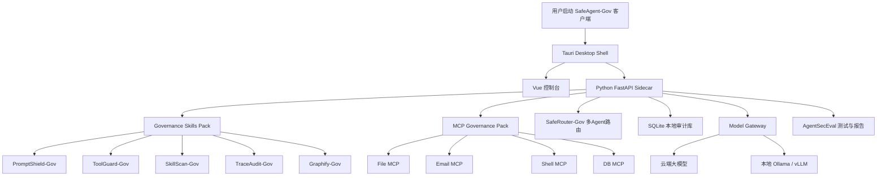

# system_plan.md

# 智御政安 SafeAgent-Gov 跨平台客户端系统规划方案

> 项目定位：SafeAgent-Gov 的核心不是桌面端、Web 端或全栈技术本身，而是一套面向政企智能体落地风险的治理技能体系。客户端只是治理技能体系的承载、展示、安装、测试和审计入口。
> 构建目标：将 SafeAgent-Gov 构建为 macOS、Windows、Linux 三端可运行客户端，使用户能够本地加载 Skills、MCP、多 Agent 路由、Graphify 能力图谱、审计与评测模块。
> 交付文件：system_plan.md、mac_client_dev.md、windows_client_dev.md、linux_client_dev.md。

---

## 1. 总体设计思想

SafeAgent-Gov 应采用“两层交付”：

```text
第一层：治理技能体系
第二层：跨平台客户端工具
```

治理技能体系是核心创新，跨平台客户端是落地载体。

```text
Governance Skills Pack
├── PromptShield-Gov
├── ToolGuard-Gov
├── SkillScan-Gov
├── SensitiveData-Gov
├── Compliance-Gov
├── TraceAudit-Gov
├── AgentSecEval-Gov
└── Graphify-Gov

Client App
├── macOS 客户端
├── Windows 客户端
└── Linux 客户端
```

客户端负责：

1. 加载治理技能体系；
2. 管理 MCP 工具服务；
3. 提供多 Agent 路由可视化；
4. 展示 Graphify 能力图谱；
5. 配置云端/本地模型接口；
6. 运行政务服务安全测试；
7. 生成审计报告和评测报告。

---

## 2. 推荐技术路线

| 层级 | 推荐技术 | 说明 |
|---|---|---|
| 客户端壳 | Tauri | 跨平台、轻量、安全、适合 Vue |
| 前端 UI | Vue 3 + Vite + TypeScript + Element Plus | 统一三端界面 |
| 后端核心 | Python FastAPI Sidecar | 承载 Skills、MCP、Graphify、Eval |
| 本地数据库 | SQLite | 桌面端轻量审计与配置存储 |
| 图谱存储 | SQLite + NetworkX | Graphify MVP |
| 可选向量 | FAISS / Chroma | 后期增强 |
| 打包工具 | Tauri Build + PyInstaller | 前端壳 + Python sidecar |
| 发布方式 | zip / dmg / msi / AppImage / deb | 三端分发 |

---

## 3. 跨平台客户端总体架构



---

## 4. 推荐项目目录结构

```text
safeagent-gov/
├── apps/
│   └── desktop/
│       ├── package.json
│       ├── vite.config.ts
│       ├── src/
│       └── src-tauri/
│           ├── Cargo.toml
│           ├── tauri.conf.json
│           ├── src/main.rs
│           └── binaries/
├── safeagent_gov/
│   ├── cli.py
│   ├── desktop_boot.py
│   ├── skills/
│   ├── mcp/
│   ├── graphify/
│   ├── router/
│   ├── audit/
│   ├── eval/
│   └── model_gateway/
├── governance-skills-pack/
├── mcp-governance-pack/
├── graphify-pack/
├── eval-pack/
├── configs/
├── datasets/
├── reports/
├── docs/
│   ├── system_plan.md
│   ├── mac_client_dev.md
│   ├── windows_client_dev.md
│   └── linux_client_dev.md
└── release/
    ├── mac/
    ├── windows/
    └── linux/
```

---

## 5. 客户端核心页面

| 页面 | 作用 |
|---|---|
| Dashboard 总览 | 展示风险数量、拦截次数、评测结果、模型状态 |
| Agent Playground | 输入政务服务任务，观察治理链路 |
| Skills Center | 查看 PromptShield、ToolGuard、SkillScan 等技能状态 |
| MCP Gateway | 管理文件、邮件、Shell、数据库等 MCP 工具 |
| Graphify Center | 展示能力图谱、路径推荐、Token 节省 |
| Router Monitor | 展示多 Agent 路由与并发执行 |
| Approval Center | 处理外部发送、数据库写入等审批 |
| Audit Trace | 查询 trace_id，生成审计报告 |
| Eval Center | 运行政务服务安全测试 |
| Model Settings | 配置云端模型、本地模型、隐私模式 |

---

## 6. 客户端运行流程

```text
启动客户端
↓
Tauri 加载 Vue 前端
↓
Tauri 启动 Python Sidecar
↓
Python Sidecar 初始化 SQLite、Skills、MCP、Graphify
↓
前端检测后端健康状态
↓
用户选择模型模式
↓
用户执行政务服务测试任务
↓
PromptShield 检测输入
↓
Graphify 召回治理技能与 MCP
↓
SafeRouter 多 Agent 路由
↓
ToolGuard 检查 MCP 调用
↓
TraceAudit 写入审计
↓
Eval Center 输出评测报告
```

---

## 7. 三端构建策略

| 平台 | 构建目标 | 产物 |
|---|---|---|
| macOS | Apple Silicon / Intel | `.app`、`.dmg`、`.zip` |
| Windows | x64 | `.exe`、`.msi`、`.zip` |
| Linux | x64 | `.AppImage`、`.deb`、`.tar.gz` |

建议使用 GitHub Actions 三平台矩阵构建：

```text
macOS runner 构建 mac 客户端
Windows runner 构建 Windows 客户端
Ubuntu runner 构建 Linux 客户端
```

---

## 8. Python Sidecar 打包策略

桌面端不建议要求用户手动启动后端。推荐用 PyInstaller 将 Python FastAPI 打包为 Sidecar：

```text
safeagent-backend-macos
safeagent-backend-windows.exe
safeagent-backend-linux
```

Sidecar 启动后监听：

```text
http://127.0.0.1:8765
```

---

## 9. 桌面端应内置与不应内置的内容

### 应内置

```text
治理技能体系
MCP 模拟工具
Graphify Lite
AgentSecEval 测试集
SQLite 本地审计
配置管理
报告生成
```

### 不建议内置

```text
大型本地模型
完整 PostgreSQL
Redis/Dramatiq 生产队列
Qdrant/Milvus 大型向量库
Docker 守护进程
真实邮件发送能力
真实 Shell 高危执行能力
```

---

## 10. 安全原则

1. 桌面端默认运行在安全模拟模式；
2. Shell、删除、数据库写入默认阻断；
3. 邮件发送默认模拟，不真实发送；
4. 所有 MCP 调用必须经过 ToolGuard；
5. 所有测试必须生成 trace_id；
6. 所有审计结果保存在本地用户目录；
7. 默认不上传用户文件到云端；
8. 云端模型调用前提示隐私风险；
9. 本地模型只作为可选增强；
10. Graphify 只做能力召回，不直接执行工具。

---

## 11. 发布包命名建议

```text
safeagent-gov-macos-arm64-v0.1.0.zip
safeagent-gov-macos-x64-v0.1.0.zip
safeagent-gov-windows-x64-v0.1.0.zip
safeagent-gov-linux-x64-v0.1.0.zip
```

---

## 12. 总结

SafeAgent-Gov 客户端不是项目核心本身，而是治理技能体系的运行容器。
三端客户端的目标是让政企用户可以在本地环境中快速体验、测试和验证：

```text
输入攻击治理
MCP 工具治理
Skill 供应链治理
Graphify 能力调度
多 Agent 路由
审计溯源
政务服务安全评测
```
